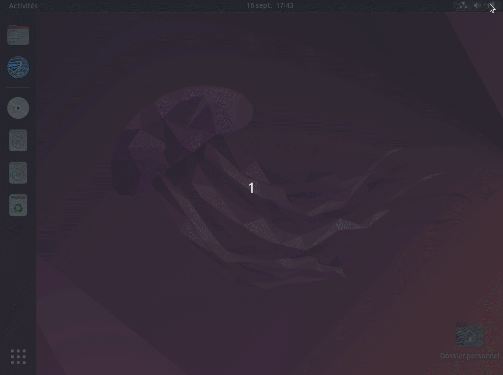

= Installation des PC de formations
:toc: left
:toc-title: Table des matières
:toclevels: 3
:experimental:
:icons: font
:pagenums:

Documentation et scripts d'installation Ubuntu sur ZFS pour les PC de formation.

== Présentation

Les scripts _bash_ présent dans le répertoire `scripts` de ce projet permettent
d'installer Ubuntu sur un système de fichier ZFS, qui offre des possibilités
de _snapshot_ et de _rollback_ idéales dans le contexte des PC utilisés en
formation.
Le répertoire `doc` contient la documentation spécifique aux différents modèles 
de PC utilisés chez Zenika pour les formations. 

== Contraintes

- le script `install.sh` utilise la totalité du disque pour l'installation ;
- l'installation nécessite une connexion à Internet ;
- pour dérouler l'installation, il faut télécharger une image disque
link:http://releases.ubuntu.com/22.04/ubuntu-22.04.1-desktop-amd64.iso[d'Ubuntu 22.04 64 bits Desktop,window=_blank],
et créer une clé USB de démarrage à partir de cette image
footnote:[Didacticiel de création d'une clé USB de démarrage d'Ubuntu : https://tutorials.ubuntu.com/tutorial/tutorial-create-a-usb-stick-on-ubuntu].

[NOTE]
====
Le script d'installation est basé sur les instructions d'installation détaillées
dans le didacticiel « Ubuntu 22.04 Root on ZFS ».
<<ubuntu-on-zfs-tutorial>>.
====

== Installation

. Démarrer une session _live_ à l'aide de la clé USB de démarrage d'Ubuntu ;
+
IMPORTANT: la session _live_ doit être lancée en mode UEFI.
. une fois la session démarrée, installer Git ;
+
```shell
$ sudo apt install git
```
. cloner ce projet ;
. ouvrir un terminal, aller dans le sous-répertoire `scripts` de ce projet et exécuter le script d'installation :
+
```shell
$ sudo ./install.sh
```
+
Par défaut l'installation est interactive et vous demande les éléments
suivants :

* chemin du disque sur lequel dérouler l'installation ;
* nom d'hôte à donner à l'ordinateur (p.ex. « pc-formation-1 ») ;
* mot de passe à attribuer à l'unique utilisateur `user` créé lors de
l'installation.

== Comment réinitialiser le PC ?

L'installation se termine par la création de _snapshots_ de chacun des
_datasets_ ZFS utilisés par le système de fichier.
Ces _snapshots_ permettent, une fois une formation terminée, de
réinitialiser l'intégralité du système de fichier du PC à sa situation
post-installation.
Une entrée dédiée à la réinitialisation est disponible au démarrage du PC,
directement depuis le menu GRUB.
Une fois la réinitialisation terminée, le PC s'éteint.
Au démarrage suivant, on le retrouve dans l'état dans lequel il était juste
après l'installation.




[appendix]
[references]
== Références

[bibliography]
* [[[ubuntu-on-zfs-tutorial,1]]] Ubuntu 22.04 Root on ZFS : https://openzfs.github.io/openzfs-docs/Getting%20Started/Ubuntu/Ubuntu%2022.04%20Root%20on%20ZFS.html
* manpage `zpool` : https://openzfs.github.io/openzfs-docs/man/8/zpool.8.html
* manpage `zfs` : https://openzfs.github.io/openzfs-docs/man/8/zfs.8.html